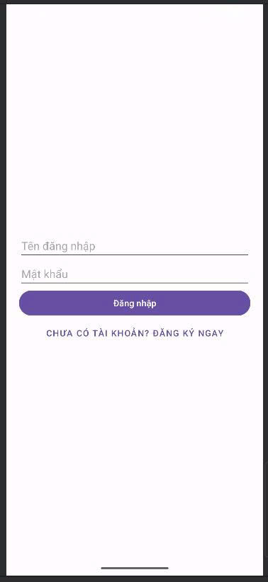
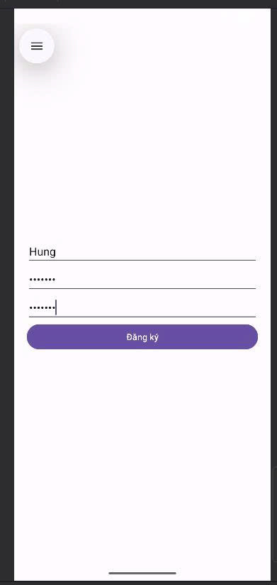

# Bài tập Anatomy of Mobile (SQLite & ProGuard)

Bài tập phát triển ứng dụng di động Android cơ bản, tập trung vào việc quản lý phiên đăng nhập người dùng sử dụng cơ sở dữ liệu cục bộ (SQLite) và tối ưu hóa ứng dụng bằng ProGuard.

## 📝 Giới thiệu

Ứng dụng này là bài tập của môn Bảo mật web và ứng dụng, bao gồm các chức năng cốt lõi: Đăng ký, Đăng nhập và Đăng xuất. Dữ liệu tài khoản người dùng được lưu trữ an toàn ngay trên thiết bị bằng SQLite. Ngoài ra, ứng dụng đã được cấu hình ProGuard để tối ưu hóa kích thước và bảo mật mã nguồn khi phát hành (Release).

## 🚀 Công nghệ sử dụng

*   **Ngôn ngữ:** Kotlin
*   **IDE:** Android Studio
*   **Cơ sở dữ liệu:** SQLite (thông qua `SQLiteOpenHelper`)
*   **Giao diện:** XML Layout
*   **Build System:** Gradle (Kotlin DSL)
*   **Bảo mật/Tối ưu:** ProGuard (R8)

## ✨ Tính năng chính

1.  **Đăng ký (Register):**
    *   Cho phép tạo tài khoản mới.
    *   Kiểm tra tính hợp lệ: không được để trống, mật khẩu xác nhận phải trùng khớp.
    *   Kiểm tra tài khoản tồn tại: Ngăn chặn đăng ký trùng Username.
    *   Lưu thông tin vào Database SQLite.

2.  **Đăng nhập (Login):**
    *   Xác thực thông tin Username và Password từ Database.
    *   Thông báo lỗi nếu sai thông tin.
    *   Chuyển hướng vào màn hình chính nếu thành công.

3.  **Màn hình chính (Home):**
    *   Hiển thị lời chào cá nhân hóa (Ví dụ: "Xin chào, Hung!").
    *   Chức năng **Đăng xuất (Logout)**: Xóa phiên làm việc hiện tại và quay về màn hình đăng nhập.

4.  **Tối ưu hóa (ProGuard):**
    *   Kích hoạt `minifyEnabled` và `shrinkResources`.
    *   Làm rối code (Obfuscate) và loại bỏ tài nguyên thừa.

## 🛠️ Cấu hình dự án & Cài đặt

### 1. Cấu trúc thư mục (Source code)
Các file source code chính được tạo và chỉnh sửa:

*   **Database:**
    *   `app/src/main/java/com/example/anatomy_of_mobile/DatabaseHelper.kt`: Xử lý tạo bảng `users`, insert và query dữ liệu.
*   **Activity (Logic):**
    *   `LoginActivity.kt`: Màn hình đăng nhập (Mặc định khi chạy app).
    *   `RegisterActivity.kt`: Màn hình đăng ký.
    *   `MainActivity.kt`: Màn hình trang chủ sau khi login.
*   **Layout (Giao diện):**
    *   `activity_login.xml`, `activity_register.xml`, `activity_main.xml`.

### 2. Thiết lập Manifest
File `AndroidManifest.xml` đã được chỉnh sửa để đặt `LoginActivity` làm màn hình khởi chạy đầu tiên (`LAUNCHER`).

### 3. Cấu hình ProGuard
File `app/build.gradle.kts` đã được bật tính năng tối ưu hóa cho bản Release:

```kotlin
buildTypes {
    release {
        isMinifyEnabled = true      // Bật làm rối và thu gọn code
        isShrinkResources = true    // Xóa các resource không sử dụng
        proguardFiles(
            getDefaultProguardFile("proguard-android-optimize.txt"),
            "proguard-rules.pro"
        )
    }
}
```

## 📱 Demo Luồng hoạt động (Walkthrough)

Dưới đây là mô tả chi tiết quy trình chạy của ứng dụng:

### Bước 1: Màn hình Đăng nhập (Khởi động)
Khi mở ứng dụng, giao diện **Login** sẽ hiện ra đầu tiên.
* Người dùng chưa có tài khoản sẽ bấm vào dòng chữ *"CHƯA CÓ TÀI KHOẢN? ĐĂNG KÝ NGAY"*.



*(Giao diện đăng nhập ban đầu)*

### Bước 2: Màn hình Đăng ký
Tại đây, người dùng nhập thông tin:
* **Tên đăng nhập:** (Ví dụ: Hung)
* **Mật khẩu:** (Nhập pass)
* **Nhập lại mật khẩu:** (Xác nhận pass)

Sau đó bấm nút **Đăng ký**. Hệ thống lưu vào SQLite và thông báo thành công.



*(Người dùng thực hiện đăng ký tài khoản mới)*

### Bước 3: Đăng nhập lại
Sau khi đăng ký thành công, ứng dụng quay về màn hình Login. Người dùng nhập tài khoản vừa tạo.
* **Username:** Hung
* **Password:** *******

Bấm nút **Đăng nhập**.


*(Nhập thông tin tài khoản vừa tạo để đăng nhập)*

### Bước 4: Màn hình chính (Welcome) & Đăng xuất
Nếu đăng nhập đúng, người dùng được chuyển đến màn hình chính.
* Ứng dụng hiển thị lời chào kèm tên người dùng: **"Xin chào, Hung!"**.
* Khi bấm nút **Đăng xuất**, ứng dụng đóng màn hình này và quay trở lại Bước 1.


*(Giao diện trang chủ hiển thị lời chào người dùng)*

---
## 👨‍💻 Tác giả

Nhóm thực hiện: Nhóm 6

Môn học: Bảo mật web và ứng dụng

Mã lớp: NT213.Q12.ANTT

---
